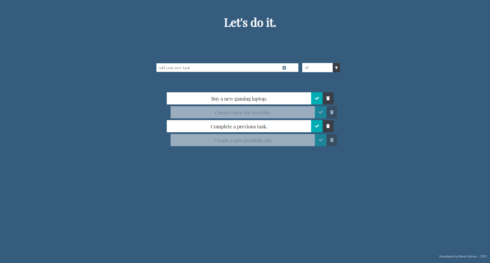

# To-do list App, fully web-hosted.
A minimalist and efficient solution to a schedule full of activities and work. Although there are many to-do list management applications, here we bring a different one. Built in JavaScript and with local storage management, you can list all your pending tasks without installing anything or accessing cookies or third-party interference.

___



## Access to the service.
Please visit [here](https://mariogomezarr.github.io/letsdoit/).
```
https://mariogomezarr.github.io/letsdoit/
```

___


## File structure.
* The project file structure is presented below.

```
|-- index.html
|-- app.js
|-- styles.css
```
* **index.html** - Structure file, with the HTML tags that make up the web page.
* **style.css** &nbsp;&nbsp;&nbsp;&nbsp;- Here is the CSS code for layout and style.
* **app.js** &nbsp;&nbsp;&nbsp;&nbsp;&nbsp;&nbsp;&nbsp; - All the logic is here. JavaScript code.

___

## Version 1 features.

* Your pending tasks can be filtered. In this sense, we can focus on what remains to be done and be more efficient. As well as reviewing the completed activities and giving feedback.
* High privacy standards. Your data remains on your device, without sending or communicating with third-party servers. There is no control over your data as it is stored locally.
* You can remove items from the list with a nice little animation.
* There is no problem if you accidentally close the browser or decide to turn off the computer. We'd already thought about it, so we've got you covered.

___
